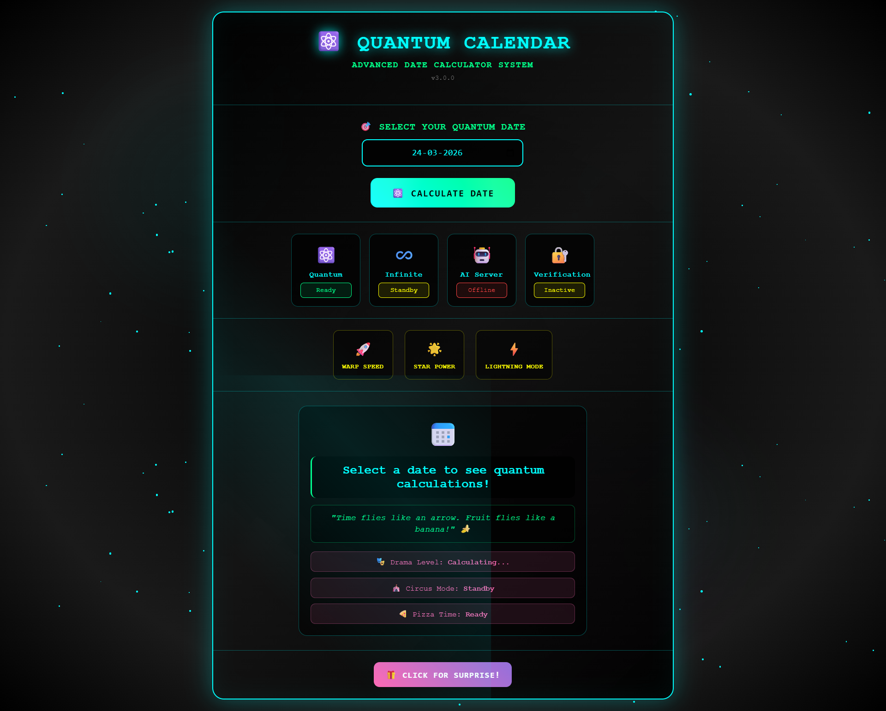

<div align="center">
  <br />
    <a href="https://your-live-demo-link.vercel.app" target="_blank">
      
    </a>
  <br />

  <div>
    
    
    
    
  </div>

  <h3 align="center">Quantum Calendar — Interactive Smart Calendar Experience</h3>

  <div align="center">
    A modern, visually engaging calendar application focused on productivity, interaction, and clean UI design.
  </div>
</div>

---

## 📋 <a name="table">Table of Contents</a>

1. 🤖 [Introduction](#introduction)
2. ⚙️ [Tech Stack](#tech-stack)
3. 🔋 [Features](#features)
4. 📸 [Screenshots](#screenshots)
5. 🤸 [Quick Start](#quick-start)
6. 📁 [Project Structure](#structure)
7. 🚀 [Future Improvements](#future)
8. 👨‍💻 [Author](#author)

---

## <a name="introduction">🤖 Introduction</a>

**Quantum Calendar** is a modern web-based calendar designed to combine productivity with interactive visual experience.

Unlike traditional calendars, this project focuses on:

- Clean developer-focused UI
- Smooth interactions
- Dynamic date handling
- Neon-inspired minimal design
- Responsive layout across devices

The goal of this project was to build a **real-world frontend product experience** while maintaining performance and simplicity.

---

## <a name="tech-stack">⚙️ Tech Stack</a>

- HTML5
- CSS3
- JavaScript (Vanilla JS)
- Responsive Design
- Modern UI/UX Principles

---

## <a name="features">🔋 Features</a>

👉 **Interactive Calendar Interface**  
Navigate months and dates smoothly with real-time updates.

👉 **Dynamic Date Calculations**  
Automatically handles day positioning and calendar logic.

👉 **Modern Neon UI**  
Minimal developer-style design inspired by modern SaaS dashboards.

👉 **Animated Visual Effects**  
Subtle animations enhance user interaction without distraction.

👉 **Fun Interaction Modes**  
Creative UI modes that add personality to the application.

👉 **Fully Responsive Design**  
Optimized for desktop, tablet, and mobile devices.

👉 **Clean Code Architecture**  
Structured project layout focused on readability and scalability.

---

## <a name="screenshots">📸 Screenshots</a>

### 📅 Smart Calendar Interface


*Minimal productivity-focused calendar designed for distraction-free planning.*

---

### ⚛️ Quantum Date Calculation


*Dynamic date rendering with interactive updates.*

---

### ✨ Animated Experience


*Subtle visual effects creating an engaging UI experience.*

---

### 🎭 Interactive Modes


*Creative interaction layers blending functionality with design.*

---

### 📱 Responsive Layout


*Optimized viewing across all screen sizes.*

---

## <a name="quick-start">🤸 Quick Start</a>

Follow these steps to run the project locally.

### Prerequisites

Make sure you have:

- Git
- Web Browser (Chrome recommended)

---

### Clone Repository

```bash
git clone https://github.com/yourusername/quantum-calendar.git
cd quantum-calendar
Run Project

Simply open:

index.html

in your browser.

No installation required.

```
## <a name="structure"> 📁 Project Structure</a>
```
quantum-calendar/
│
├── assets/
│   ├── banner.png
│   └── screenshots/
│
├── css/
│   └── styles.css
│
├── js/
│   └── script.js
│
├── index.html
└── README.md
```

## <a name="future"> 🚀 Future Improvements</a>
Event scheduling system
Local storage persistence
Dark/Light theme switcher
Calendar reminders
Backend integration
Google Calendar sync

## <a name="author">👨‍💻 Author</a>

Krushna Nawale<br><br>

GitHub: https://github.com/Krushna4142<br>
LinkedIn: https://www.linkedin.com/in/krushna4142/<br><br><br>
<div align="center">

⭐ If you like this project, consider giving it a star!

</div> ```
